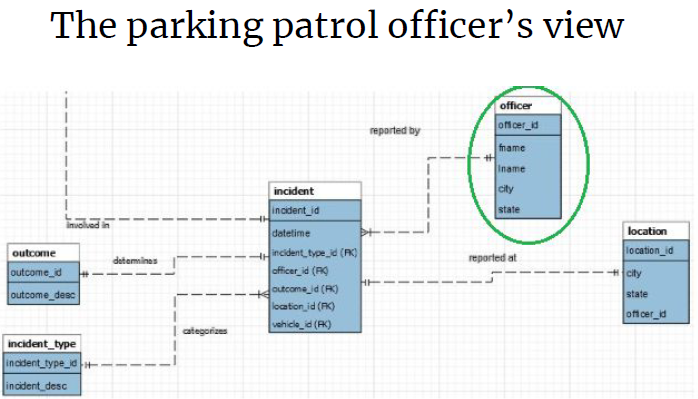
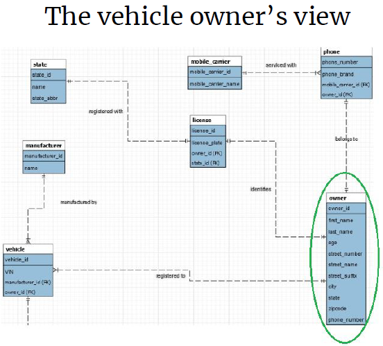
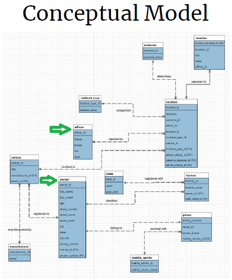

# Parking Warning
## Introduction
The Parking Warning System notifies drivers via text message that their vehicle
has been flagged by a parking patrol officer for expired parking, before their
car receives a citation. This system integrates mobile devices with DMV
databases to enable real-time one-way communication directly with the vehicle
owner.

This back-end relational database system enables SMS warnings to
 reduce unwanted parking citations.

# Technologies

 * Java, version 8

 * MySQL Workbench 8.0 Community Edition

 * QueryRunner.java - OTS app for GUI and CLI execution

# Database Schema

This Entity Relationship Diagram shows how data tables are related,
 specific to roles of the System users.

[See Entity Relationship Diagrams](./img/)

# Use Case
## Problem Scenario
*Drivers worry about getting a parking ticket on street parking locations.*

Millions of city drivers can have a more positive experience when parking their
 vehicles on city streets. Currently, city parking officers issue a parking
 citation for any vehicle that has exceeded the posted parking limit. Though
 the motorist is responsible for moving the car on time, it can be easy to
 lose track of time, or to forget to set a timer. This often results in
 unwanted parking fines.

## Solution
● This database serves as a web application stored on a mobile device used by a
 parking patrol officer.
● The application interfaces with the mobile phone SMS of vehicle motorists.
● The officer scans and records information that identifies each vehicle
 violating parking rules
● Owner receives warning messages
● This system will result in fewer worries and concerns about unwanted parking
 citations for city drivers.
